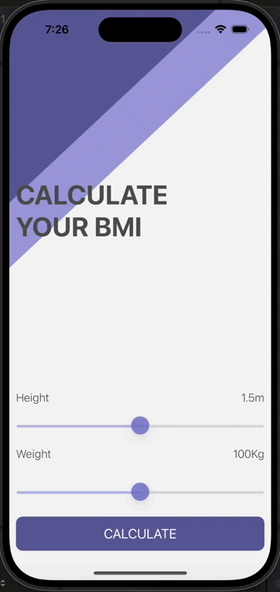

#  BMI Calculator

## Goal

BMI Calculator is a seamlessly designed application developed using Swift and following the Model-View-Controller (MVC) architectural pattern. It provides users with a user-friendly interface to effortlessly calculate their Body Mass Index (BMI). Here's a concise breakdown of its key features:

## Drag Views for Weight and Height Inputs

BMI Calculator integrates draggable views for weight and height inputs, allowing users to conveniently set their desired values with a simple swipe or drag gesture. This interactive input method enhances user engagement and provides a smooth and intuitive experience.

## Calculation of BMI

The app employs Swift to perform BMI calculations based on user-provided weight and height inputs. BMI is calculated using the standard formula: BMI = weight (kg) / (height (m) * height (m)). This functionality ensures accurate BMI computation, empowering users to monitor their health effectively.

## Result Display on Modal Screen:

Upon entering weight and height data, users can immediately view the calculated BMI result presented on a modal screen. The modal screen displays the calculated BMI value along with a contextual interpretation, such as underweight, normal weight, or overweight, providing users with valuable insights into their health status.

## Intuitive User Interface:

BMI Calculator offers a clean and intuitive user interface, prioritizing simplicity and clarity for seamless user interaction. Users can effortlessly input their weight and height and navigate through the app with ease, ensuring a hassle-free experience.